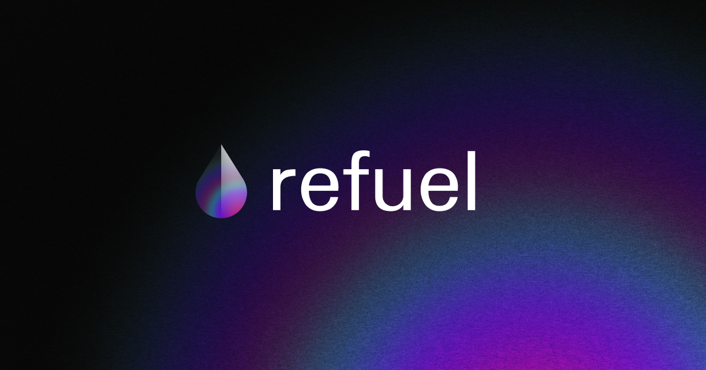

# refuel
⛽ Don't let your account run out of fuel

> **Warning**
>
> This is my sandbox project to try out Gelato (and Uniswap v3, along the way). Don't take it seriously.

---

## How it works

### The Problem

It's always sad when your native network token balance runs out, and you can't send any transaction anymore. You **do** have some assets in non-native tokens but still can't exchange them because you **don't have enough amount of the native token to pay for the gas**!

So, you need to top up your balance through a bridge with another network or, even worse, use a fiat gateway!

🤯 🤯 🤯

### The Solution

With **`refuel`** you won't have to worry about your balance anymore! When the balance is about to run out, `refuel` will replenish it by swapping the required amount of the token of your choice.

### Okay, but what's going on exactly?

- User selects
  - the source token
  - the watched token
  - the threshold
  - the amount to replenish
  - the maximum amount of the source token to spend
- `refuel` submits a [gelato](https://www.gelato.network/automate) task
- The task executes a [uniswap v3](https://uniswap.org/) swap if the balance of the watched token gets less than the threshold

> **Note** Conditions of the task's execution are resolved by the [`RefuelResolver`](./contracts/contracts/RefuelResolver.sol) contract.

> **Note** Swap is provided by the [`Refuel`](./contracts/contracts/Refuel.sol) contract. Gelato automation contract is the only who allowed to exec its `execute` method.

User can see all their active tasks.
For more actions like pausing / restarting tasks, it's always an option to go to the [Gelato Automate app](https://app.gelato.network/task/) since all the tasks in `refuel` are mined directly by the user.

### Deployments

`refuel` is deployed only on Goerli Testnet now. The swap implementation is very basic and follows [the Uniswap tutorial](https://docs.uniswap.org/contracts/v3/guides/swaps/single-swaps) closely, so it's not production-ready.

But you can pick up the idea if you like 😉

| Contract | Goerli Address |
| --- | --- |
| [`Refuel`](./contracts/contracts/Refuel.sol) | `0xA573493A66d946212763EC26cC9D117b1a03b026` |
| [`RefuelResolver`](./contracts/contracts/RefuelResolver.sol) | `0xF92d58e8227a1652C3dAa6cF19aC64f0F45F8C2e` |
